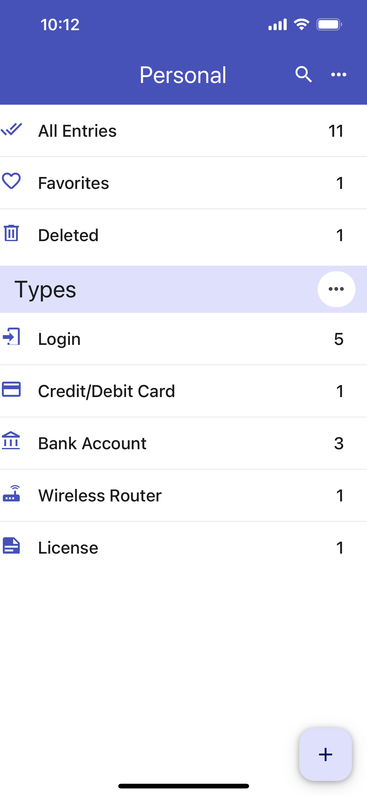
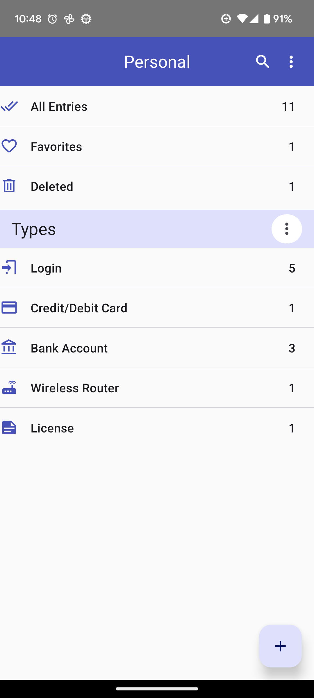

<h1 align="center">
  
   
  
OneKeePass

</h1>

**OneKeePass Mobile Application** is a open source and secure password manager. It supports the KeePass-compatible database (Kdbx 4.x). It stores and manages all your passwords and other sensitive information in a single encrypted file that can be stored in any location, including local and public cloud solutions. The app relies on iOS and Android OS provided integration with storage providers.  

All created database files are encrypted using the best and most secure encryption algorithms currently known (AES-256, ChaCha20).The database is locked with a master key.

You can install OneKeePass for Android from Google Play store and OneKeePass for iOS from Apple app store

 

| iOS  | Android |
| ------------- | ------------- |
|  | |

OneKeePass is also available for **Windows, macOS and Linux desktops**.

## Features
- Modern UI
- Entries are grouped as Types or Categories or the standard Group tree
- Any number of custom fields can be added
- Custom fields can be organized as section
- Any number of databases can be created and used
- Fully offline 

## Todo
- [ ] Upload attachments to an entry 
- [ ] AutoFill support
- [ ] Optional additional security of using of a key file 
- [ ] Integrate with biometrics (fingerprint)
- [ ] Merge changed entries
- [ ] TOTP storage and generation 
- [ ] Multi-language support
- [ ] Support YubiKey 

## How to Contribute
The CONTRIBUTING document and other guidelines for code contributions are not yet ready. Till that time, please feel free to::
- [Report bugs, suggest new features](https://github.com/OneKeePass/mobile/issues)

## License
This project is licensed under the GPLv3.
