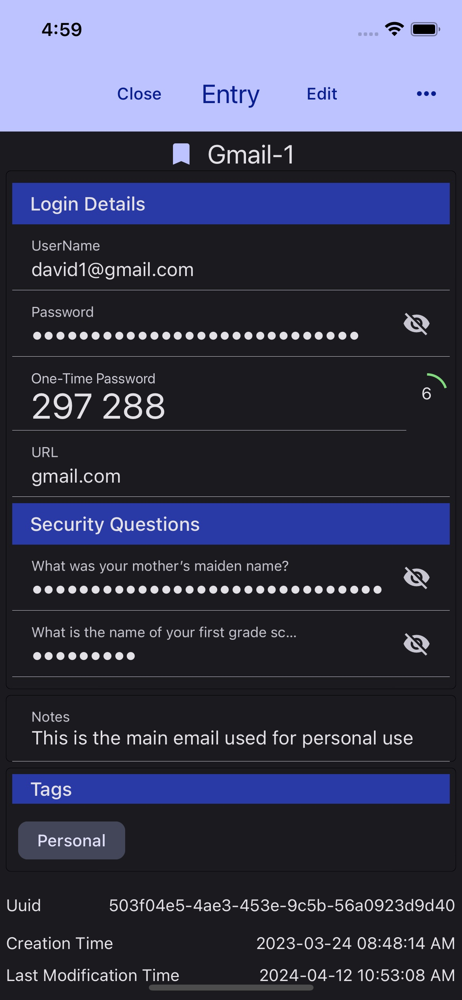
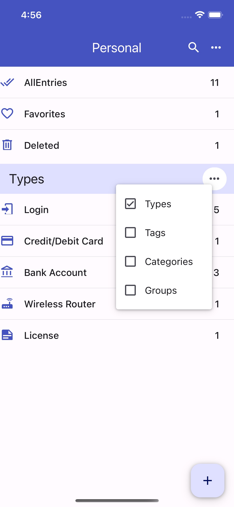
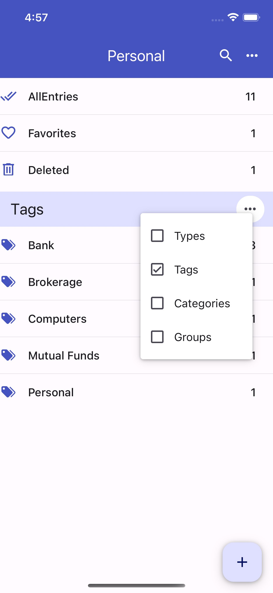

# Frequently Asked Questions

Here are some common ones. More will be added in due time

## Where and how the database is stored?
OneKeePass stores all your passwords and other details in a single encrypted file in any place supported by the iOS's Files app or Android supported File Manager - typically called "My Files" or just "Files"

## Can one store and use database files from Dropbox, GoogleDrive, OnedDrive, etc?

Yes. But you need to install Dropbox or GoogleDrive or OnedDrive app on your device. This app in turn integrates with the **File App** of iOS or Android. Then OneKeePass app can open from these storages

At this time, there is no remote API based integration to any of these storage services

## What is the format of the OneKeePass database?
OneKeePass supports only the well known new [KeePass](https://keepass.info/help/kb/kdbx_4.1.html) database format KDBX 4. You will not able to use any old database format.

## What is a key file ?
A key file is a file containing random bytes that is used in addition to your master key for additional security. You can basically use any file you want as a key file. Such a file should have random bytes data and the content of this random data remains the same as long as it is used as key file.

## What is mater key?
The database file is encrypted using a master key. This master key is derived using multiple components: a master password, a key file or both

Accordingly you can use only a master password or only a key file or both to secure your database

## How many databases can be opened ?
You can open many databases at the same time.

## How to synchrozie the database file between devices?
OneKeePass does not do any automatic synchronization at this time. As the password database is a single file, you can use any of the cloud storage service for the synchronization between devices and also for the backup

## Are file attachments supported?
Yes. You can attach any number of files to an entry. In the entry form screen, you can upload, view and delete. Any previously attached file can be copied to a location outside the database.

It is recommended to use this feature only to store few/small files.
 
As these attached file contents are encrypted and stored within the database, attaching many/large files is considered to be out of the scope of a password manager. The database opening and saving then will be slow. It is better to use a specialized file encryption softwares - VeraCrypt,Cryptomator - to store many/large files

## How do to add one or more TOTPs (Timed One-Time Passwords) to an Entry?
Select an entry and click **Edit** button or add a new entry. When the entry form is in edit mode, you can click **Set up One-Time Password** to add a TOTP - [Fig 1](../screenshots/i-otp-setup-1.jpg). A dialog box is opened - [Fig 2](../screenshots/i-setup-dialog-1.jpg). In the dialog box, you can chose to scan a QR code or to enter the secret string or OTP url that you got from the website or application you are authenticating to. On scanning QR code or entering valid values, the otp token will be generated 

You can add more than one TOTP fields for an Entry under the section **ADDITIONAL ONE-TIME PASSWORDS**. To add additional OTP fields, please click on the **+** as seen in [Fig 1](../screenshots/i-otp-setup-1.jpg). In the opened dialog - see [Fig 2](../screenshots/i-setup-dialog-1.jpg) - you can chose to scan or enter otp values. You need to enter a field name as shown in [Fig 3](../screenshots/i-setup-dialog-2.jpg), 

If you want to update or to change an OTP field, the existing field needs to be deleted first and added with new values

On Android, you can also scan a QR code with the device **Camera** app. Tapping the `otpauth://` link the camera finds offers OneKeePass in the list of apps. You can then add that code to an existing entry or to a new entry. If the entry you pick already has a one-time password code, you are asked before the earlier code is replaced.

The current code of an entry, and the time it has left, are also shown on each row of the entry list - in the main app and in the AutoFill extension - so you can read a code without opening the entry.

You can see generated OTP values with progress indicators

<h1 align="center">
  
   
</h1>

## How to fill username and passwords automatically to login to an app?

OneKeePass now supports the **Autofill** feature in both iOS and Android. 

You can now seamlessly log in to websites and apps while maintaining strong and secure passwords in OneKeePass when you use the autofill service provided by OneKeePass

To use Autofill with OneKeePass, you need to enable OneKeePass in the device system settings first

## Can AutoFill also fill the one-time verification code?

Yes, when the entry has a one-time password code set up.

**Android:** a sign-in form that asks for the user name, the password and a verification code is filled in one selection, and a page that asks only for the code is filled on its own.

**iOS:** the code is offered in the keyboard suggestion (QuickType) bar, and tapping it fills the code field. On a form that asks for the password and the code together, iOS asks a third party provider only for the password, so OneKeePass copies the code to the clipboard for you to paste. The clipboard is cleared again a short while later.

## What are passkeys and how do they work in OneKeePass?

Passkeys are a modern passwordless authentication method based on the WebAuthn/FIDO2 standard. Instead of typing a password, you authenticate using a cryptographic key pair stored securely in your database.

OneKeePass can act as a passkey provider on both iOS (17+) and Android (14+). When a website or app requests a passkey, the OneKeePass AutoFill extension handles the sign-in or registration directly.

**Sign-in (Assertion):** When a website asks for a passkey, OneKeePass finds matching passkeys in your open databases and lets you select one to sign in.

**Registration (Creation):** When creating a new passkey, you can choose which group and entry to store it in, or create a new group during registration.

**iOS:** Passkeys created in the AutoFill extension are saved as pending. When you next open the main app, you can review and commit them to your database.

**Android:** Passkeys are saved directly to your database during registration. Works with Chrome, Firefox, Brave and other browsers that use the system credential manager.

Passkey entries are stored in standard KDBX4 format, compatible with other KeePass-based password managers.

To use passkeys, enable OneKeePass as a credential/passkey provider in your device system settings.

## How are entries organized ?
Entries are organized so that you can view them as Entry types or Categories or Group tree or Tagged entries. 

Types

<h1 align="center">
  
   
</h1>

Tags

<h1 align="center">
  
   
</h1>

## What are the entry categories ?
It is just the flattened list of keepass groups instead of a tree/folder like structure

## What is an entry type?
Each entry type is a template that has certain set of fields. For example *Login* entry type include fields like username, password, url etc.
OneKeePass supports these built-in standard entry types: Login, Credit/Debit Card, Bank Account, Wireless Router, Identity, Passport, Driver License, SSH Key, SFTP Connection and WebDAV Connection.
More standard entry types will be added. 

## Can I add my own sections to an entry?

Yes. Every entry type comes with its own sections - *Login Details* for a Login entry, for example - and you can add any number of sections of your own on top of those.

Open the entry and put the form in **edit** mode. At the bottom of the form, tap **Additional section and custom fields** and give the new section a name. The section is then shown in the form like any other.

The three-dot menu on a section header offers **Change Name** and **Add Custom Field**. A section that you added can be renamed; the sections that come with the entry type cannot.

## How do I add a custom field, and what does "Protected" mean?

In edit mode, tap the three-dot menu on the header of the section the field should go into and choose **Add Custom Field**. Give the field a name and choose its type:

- **Text** - an ordinary text value
- **Boolean** - an on/off switch
- **Date** - a date chosen with the native date picker

You can also tick **Protected** for a Text field. A protected field is treated the same way as the Password field:

- Its value is masked in the entry form and is shown only while you tap the eye icon
- It is stored in the database file marked as protected, and is additionally encrypted within the already encrypted database, in the standard KDBX way - so other KeePass applications read such fields correctly
- It is never matched by the AutoFill search, so a secret value cannot be found by typing part of it into the search bar

Boolean and Date values are never masked, so **Protected** cannot be ticked for those two types.

The three-dot menu shown next to a custom field lets you rename it, change its type or protection, or delete the field with **Delete Field**.

## How to do merging of two databases?

After opening a database, you can use the application menu "Merge Database" 

Then choose any of a valid keepass database file to merge with the currently opened file. The merged database will be saved immediately.

Please keep a backup copy of the database before merging into that database

## How do I use custom icons for entries and groups?

You can assign custom icons to any entry or group. Icons can be added from a local image file or automatically fetched as a favicon from a website URL.

To manage all custom icons stored in a database, go to **Settings -> Manage Icons** (while the database is open). From there you can upload new icons, add icons by URL, and delete icons that are no longer needed.

To assign an icon to an entry, open the entry form in edit mode and select the icon field. To assign an icon to a group, open the group form and select the icon field.

Custom icons are stored inside the KDBX database file, are compatible with other KeePass-based applications, and are also displayed in the AutoFill extension.

## Can I store my database on a remote SFTP or WebDAV server?

Yes. OneKeePass supports creating and opening databases stored directly on SFTP and WebDAV servers.

**Opening a remote database:** Use the **Open Remote** option and choose SFTP or WebDAV. Enter your server details to browse and select a database file.

**Creating a new remote database:** Use the **New Database** option and choose to save to a remote server location.

**Remote connection entries:** You can store your SFTP or WebDAV server credentials securely inside the database using the built-in entry types **SFTP Connection** and **WebDAV Connection**. When these entries exist, OneKeePass uses them automatically to reconnect to the server, so you do not have to re-enter credentials each time.

## What are "SFTP Connection" and "WebDAV Connection" entry types?

These are built-in entry types for storing remote server connection credentials inside your database.

An **SFTP Connection** entry holds the host, port, username, and optionally a private key for an SSH/SFTP server.

A **WebDAV Connection** entry holds the server URL, username, and password for a WebDAV server. You can also enable **Allow Untrusted Certificate** in the entry if your server uses a self-signed certificate.

Once these entries exist in your database, OneKeePass uses them automatically when you open or save a remote database on that server.

## What happens if my database file is changed remotely?

OneKeePass detects when the remote database file has been changed by another device or instance. When this happens, you are notified and can choose to merge the remote changes into your current session. The merge follows the same conflict-resolution rules as the local external-change detection.

## How do I find and sort my entries?

The search bar shown on the pages of an open database matches entries anywhere in that database, not only in the list you are looking at. The results are sorted the same way the list is.

Entries can be sorted by **Title**, **Modified Time** or **Created Time**, in ascending or descending order. The sort action is available both on the page listing the categories and on the entry list itself, and your choice is remembered.

## Can I make a copy of an entry?

Yes. **Clone Entry** is available from the entry list and from the entry form menu. A long press on an entry row highlights it and opens that menu.

## How do I save a copy of my database to another place?

Use the **Save As** action in the database menu. You can pick the destination with the device file picker or choose an SFTP or a WebDAV connection.

Save As writes a copy and nothing more. The database you are working on stays open and unchanged, the copy is not opened and is not added to the recently used list. If a file of that name is already there, you are asked before it is overwritten.

This is different from **Export To**, which hands the database file over to the system share sheet.

## What happens when a database is locked?

When you lock a database - from the menu or after the session timeout - its content is encrypted in memory and the decrypted content is removed. Nothing readable is left in the app's memory while the database is locked. Unlocking with your credentials or biometrics decrypts it again and you continue from where you were.

## Why can a database opened from another app sometimes not be saved?

It depends on how the other app hands the file over.

Some apps - a cloud storage app, a mail or a messaging app - pass only a **copy** of the file rather than the file itself. Anything you changed in a copy would never reach the original, so OneKeePass does not open it that way. Instead, use the **Open Database** action and pick the database from where it is actually kept. If the file came from a mail or a messaging app, save it to the Files app first and then open it from there.

Some apps hand the file over with **read only** access. The database opens and can be used, but changes cannot be written back to it. Use **Save As** to keep your changes in another file.

## In which languages is the app available?

English, Arabic, German, Spanish, French, Indonesian, Brazilian Portuguese, Russian, Vietnamese and Chinese.

If you want to help with a translation, please see [OneKeePass Translations](https://github.com/OneKeePass/onekeepass-translations)

