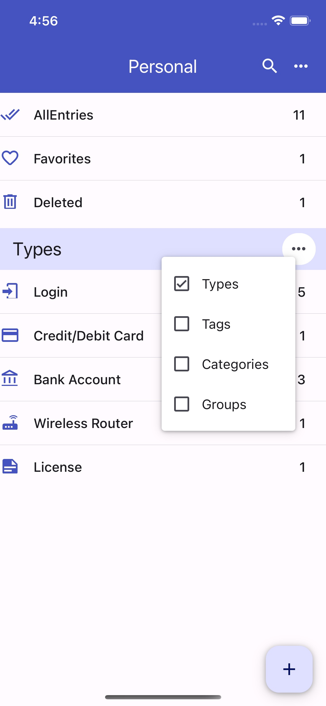

# Frequently Asked Questions

Here are some common ones. More will be added in due time

## Where and how the database is stored?
OneKeePass stores all your passwords and other details in a single encrypted file in any place supported by the iOS's Files app or Android supported File Manager - typically called "My Files" or just "Files"

## Can one store and use database files from Dropbox, GoogleDrive, OnedDrive, etc?

Yes. But you need to install Dropbox or GoogleDrive or OnedDrive app on your device. This app in turn integrates with the **File App** of iOS or Android. Then OneKeePass app can open from these storages

At this time, there is no remote API based integration to any of these storage services

## What is the format of the OneKeePass database?
OneKeePass supports only the well known new [KeePass](https://keepass.info/help/kb/kdbx_4.1.html) database format KDBX 4. You will not able to use any old database format.

## What is a key file ?
A key file is a file containing random bytes that is used in addition to your master key for additional security. You can basically use any file you want as a key file. Such a file should have random bytes data and the content of this random data remains the same as long as it is used as key file.

## What is mater key?
The database file is encrypted using a master key. This master key is derived using multiple components: a master password, a key file or both

Accordingly you can use only a master password or only a key file or both to secure your database

## How many databases can be opened ?
You can open many databases at the same time.

## How to synchrozie the database file between devices?
OneKeePass does not do any automatic synchronization at this time. As the password database is a single file, you can use any of the cloud storage service for the synchronization between devices and also for the backup

## Are file attachments supported?
Yes. You can attach any number of files to an entry. In the entry form screen, you can upload, view and delete. Any previously attached file can be copied to a location outside the database.

It is recommended to use this feature only to store few/small files.
 
As these attached file contents are encrypted and stored within the database, attaching many/large files is considered to be out of the scope of a password manager. The database opening and saving then will be slow. It is better to use a specialized file encryption softwares - VeraCrypt,Cryptomator - to store many/large files

## How do to add one or more TOTPs (Timed One-Time Passwords) to an Entry?
Select an entry and click **Edit** button or add a new entry. When the entry form is in edit mode, you can click **Set up One-Time Password** to add a TOTP - [Fig 1](../screenshots/i-otp-setup-1.jpg). A dialog box is opened - [Fig 2](../screenshots/i-setup-dialog-1.jpg). In the dialog box, you can chose to scan a QR code or to enter the secret string or OTP url that you got from the website or application you are authenticating to. On scanning QR code or entering valid values, the otp token will be generated 

You can add more than one TOTP fields for an Entry under the section **ADDITIONAL ONE-TIME PASSWORDS**. To add additional OTP fields, please click on the **+** as seen in [Fig 1](../screenshots/i-otp-setup-1.jpg). In the opened dialog - see [Fig 2](../screenshots/i-setup-dialog-1.jpg) - you can chose to scan or enter otp values. You need to enter a field name as shown in [Fig 3](../screenshots/i-setup-dialog-2.jpg), 

If you want to update or to change an OTP field, the existing field needs to be deleted first and added with new values

You can see generated OTP values with progress indicators

<h1 align="center">
  
   
</h1>

## How to fill username and passwords automatically to login to an app?

OneKeePass now supports the **Autofill** feature in both iOS and Android. 

You can now seamlessly log in to websites and apps while maintaining strong and secure passwords in OneKeePass when you use the autofill service provided by OneKeePass

To use Autofill with OneKeePass, you need to enable OneKeePass in the device system settings first

## How are entries organized ?
Entries are organized so that you can view them as Entry types or Categories or Group tree or Tagged entries. 

Types

<h1 align="center">
  
   
</h1>

Tags

<h1 align="center">
  
   
</h1>

## What are the entry categories ?
It is just the flattened list of keepass groups instead of a tree/folder like structure

## What is an entry type?
Each entry type is a template that has certain set of fields. For example *Login* entry type include fields like username, password, url etc.
OneKeePass supports some built-in standard entry types: Login, Credit/Debit Card, Bank Account and Wireless Router.
More standard entry types will be added. 

## How to do merging of two databases?

After opening a database, you can use the application menu "Merge Database" 

Then choose any of a valid keepass database file to merge with the currently opened file. The merged database will be saved immediately.

Please keep a backup copy of the database before merging into that database

